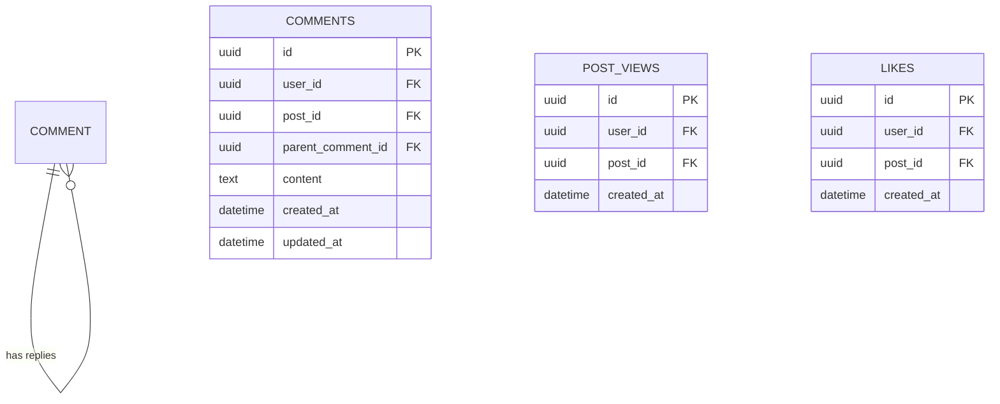

```mermaid
erDiagram
    COMMENT ||--o{ COMMENT : "has replies"

    COMMENTS {
        uuid id PK
        uuid user_id FK
        uuid post_id FK
        uuid parent_comment_id FK
        text content
        datetime created_at
        datetime updated_at
    }
    
    POST_VIEWS {
        uuid id PK
        uuid user_id FK
        uuid post_id FK
        datetime created_at
    }

    LIKES {
        uuid id PK
        uuid user_id FK
        uuid post_id FK
        datetime created_at
    }
```