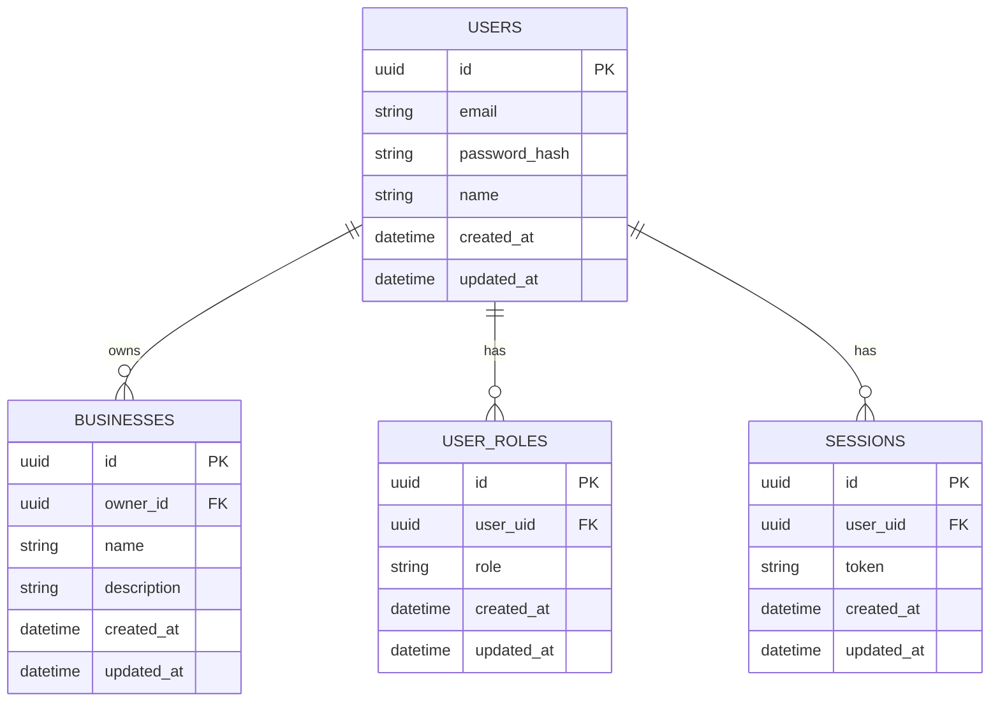

```mermaid
erDiagram
    USERS ||--o{ BUSINESSES : "owns"
    USERS ||--o{ USER_ROLES: "has"
    USERS ||--o{ SESSIONS: "has"
    
    USERS {
        uuid id PK
        string email
        string password_hash
        string name
        datetime created_at
        datetime updated_at
    }

    USER_ROLES {
        uuid id PK
        uuid user_uid FK
        string role
        datetime created_at
        datetime updated_at
    }

    SESSIONS {
        uuid id PK
        uuid user_uid FK
        string token
        datetime created_at
        datetime updated_at
    }

    BUSINESSES {
        uuid id PK
        uuid owner_id FK
        string name
        string description
        datetime created_at
        datetime updated_at
    }
```